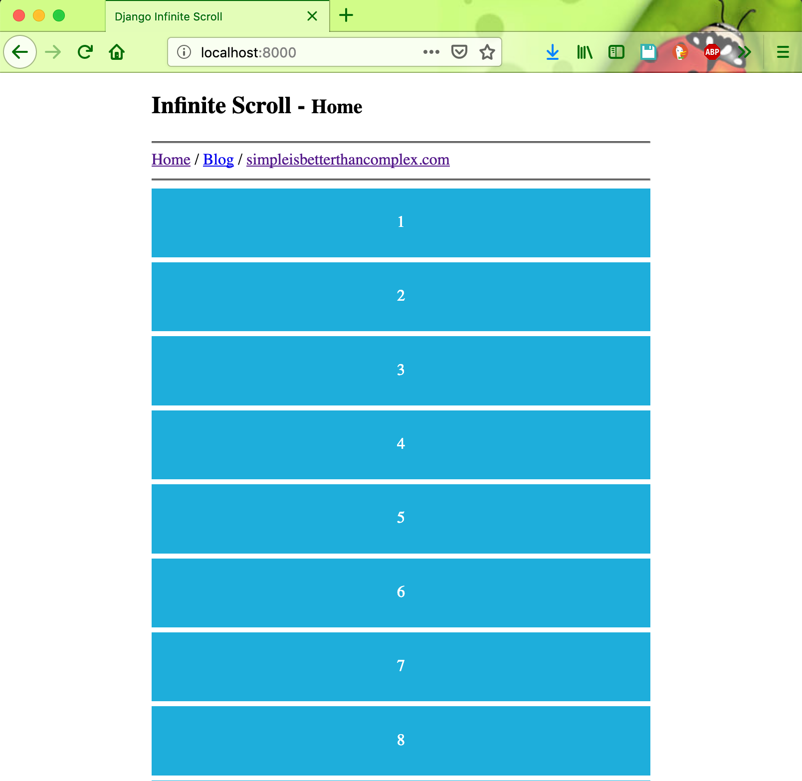

# django-simple-infinite-scroll

Django Simple Infinite Scroll

Example used in the blog post How to Create Infinite Scroll With Django
#### Running Locally

`git clone https://github.com/hendisantika/django-simple-infinite-scroll.git`

`pip install -r requirements.txt`

`python manage.py migrate`

`python manage.py runserver`

#### Screen shot

Home Index

